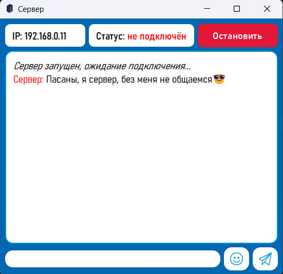
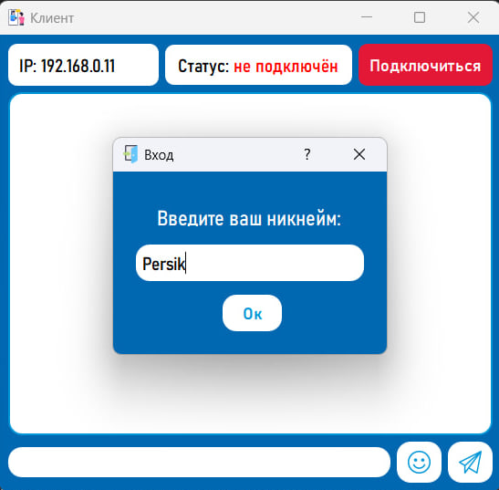
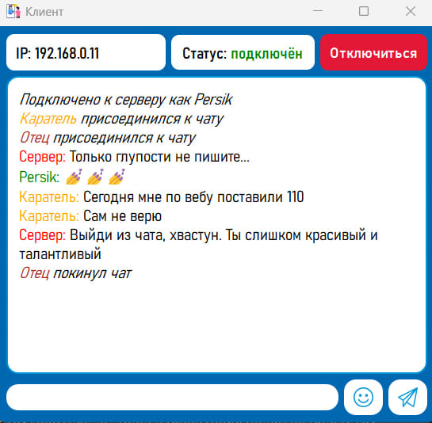

# Tipa Messenger - minimalism, speed, communication😎

## Description
**Tipa Messenger** is a simple chat for communicating with friends and colleagues. The app is designed specifically for small groups of users. Developed in Python using sockets for network interaction, it allows easy real-time message exchange. The graphical interface is built with the PyQt library, offering a clean and minimalist user experience.

## Features
- Real-time messaging for small groups
- Simple and minimalist interface
- Nickname selection for users
- Emoji support for more expressive conversations

## Instructions 

1. Download the server.exe and client.exe files.
2. Make sure both devices are connected to the same network.
3. Run server.exe on one computer and click the "Start" button to launch the server.
4. On another computer, run client.exe, enter the server's IP address, and choose your nickname.
5. You're ready to chat!

Clients cannot communicate without the server running.

